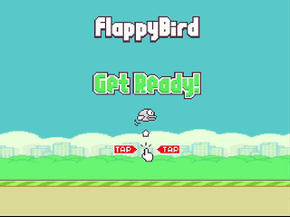

# Flappy Bird
## Getting Started
#### **Download the Zip File**, and extract it anywhere. After extracting place all files in a single folder and open flappy.py and Enjoy 😄. 
## Description Of Game
<ul>
  <li>This is a single-player game based on the infamous Flappy Bird Game.</li>
  <li>It is Made in python with the help of pygame Library.</li>
</ul>

## Features 
<ol>
  <li><b>Game has multiple states like loading/playing/Game-over.</b></li>
  <li><b>Bird has flapping animation</b>.</li>
  <li><b>Bird has rotation mechanism</b>.</li>
  <li><b>Game has score/high-score system</b>.</li>
  <li><b>Game has Day-Night Cycle based on Player Score</b>.</li>
  <li><b>Clean code using functions</b>.</li>
  <li><b>Pipes despawn after going out of screen to give increase in performance.</b></li>
</ol>

## Cheat
<h3>I have added a cheat in the game when you press left ctrl, The Bird Becomes Invincible :wink:</h3>

## How To Play

 The Game Is Pretty Easy To Play. <b><i>To Make Bird Move Press Space</i></b>, 
You have to safe the bird from getting hit with the pipes in the game. <b>You will get 2 points on each successive safe</b>  
Try To Score as much as you can, So, Good Luck! &#128077.

### Demo

## Inspiration
I made this game watching clear-code's Youtube video here [Tutorial](https://www.youtube.com/watch?v=UZg49z76cL)

# Finally Thank You! For trying my game. :innocent:
